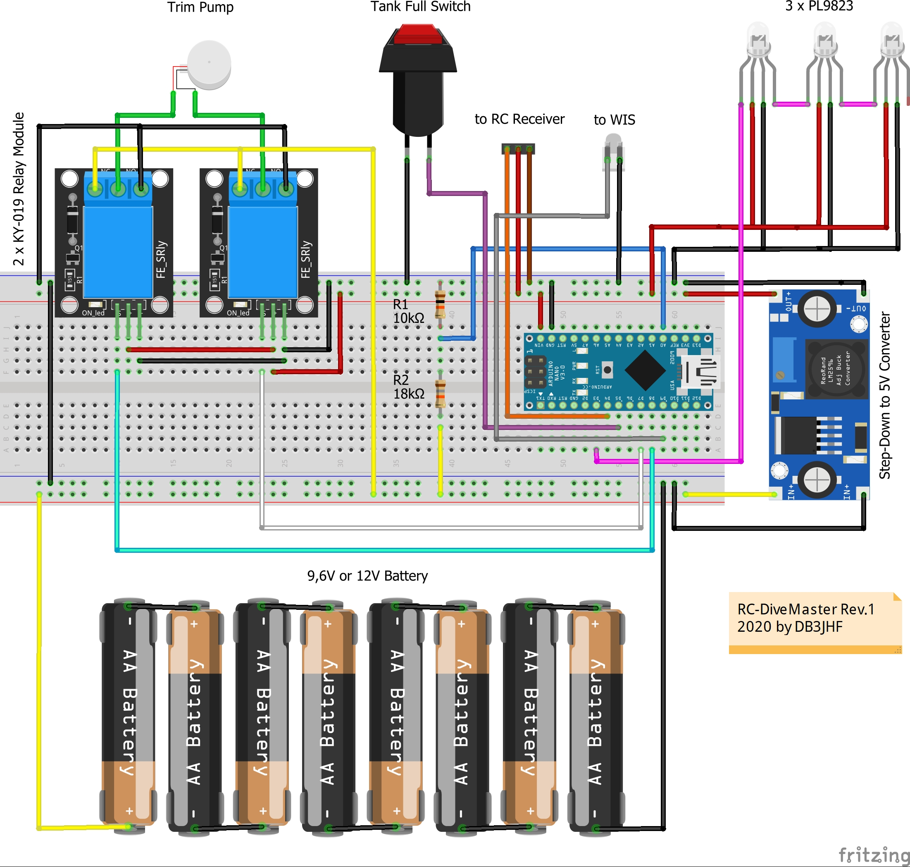

# RC-DiveMaster
Dive Controller for RC-Submarines based on Arduino Nano

It was designed to fit Robert Cook's https://www.thingiverse.com/thing:4560120 (Subnautica Cyclops Submarine).

## Schematics / Parts assembly

## Features
- Control of the trim tank filling
- Compatible with an analog RC-Receiver e.g. Graupner Superhet C16
- Auto shut off trim pump when trim tank is full
- Input for water ingress sensor
- Monitoring the battery voltage
- System status via 3 multicolor LEDs
- Auto surface when battery is low, water ingress is detected or RC signal is lost
